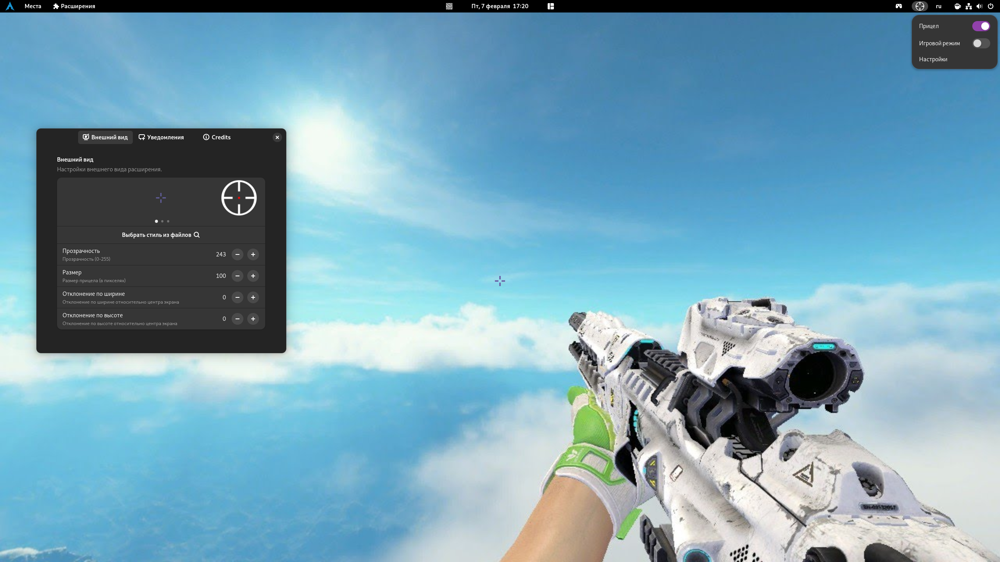
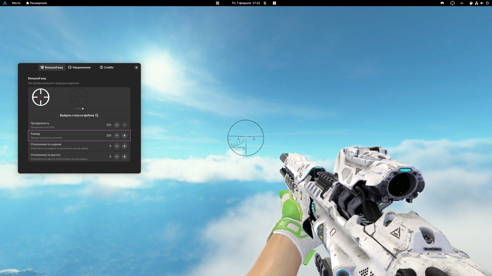

<h1 align="center">GCTD - Game Crosshair To Desktop (Gnome Extension)</h1>
<h3>This extension adds a scope to the desktop that is displayed on top of all apps and games. The scope can be customized in the extension settings.</h3>

 

  <h1 align="center">Screenshots</h1>
  

  
  
  

  

 

<!--<h1>Installation</h1>-->
<!--<h2>GNOME website (recommended)</h2>-->
<!--<a href="https://extensions.gnome.org/extension/7853/game-crosshair-to-desktop/">-->
<!-- 
Button SVG by Just Perfection developer https://extensions.gnome.org/accounts/profile/JustPerfection
-->
<!---->
<!--</a>-->

<!-- -->

<h1>Build from source</h1>
<h3>1. Download & install extension</h3>
<pre language="bash">
<code>git clone https://github.com/VenerisAsgard/GCTD.git
cd GCTD
cp -r GCTD@dev.va_icloud.com $HOME/.local/share/gnome-shell/extensions
</code></pre>
<h3>2. Logout and login again</h3>

 

<h1 align="center">Packaging</h1>
<h3>Generate *.pot (Bash):</h3>
<pre language="bash">
<code>find . -name "*.js" -exec xgettext --from-code=UTF-8 --output=po/GCTD@dev.va_icloud.com.pot {} +</code>
</pre>
<h3>Generate *.mo(Bash):</h3>
<pre language="bash">
<code>gnome-extensions pack --podir=po GCTD@dev.va_icloud.com/</code>
</pre>

 

<h1 align="center">Thanks</h1>
<h5><a href="https://gitlab.gnome.org/jrahmatzadeh/just-perfection">Just Perfection</a></h5>
<h5><a href="https://github.com/ExposedCat">ExposedCat</a></h5>
